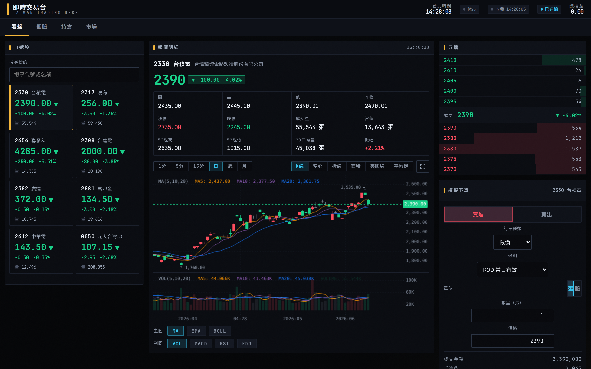
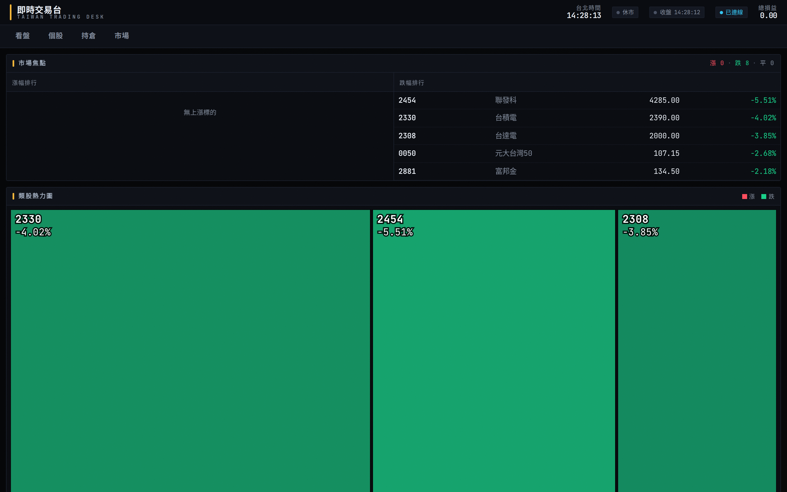
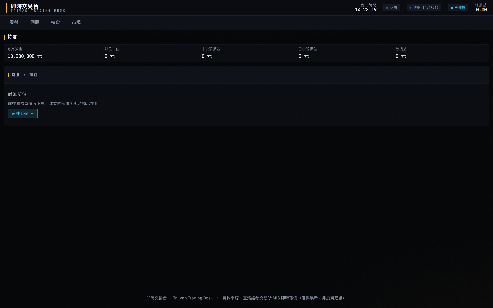

# 即時交易台 · Taiwan Real-Time Trading Desk

即時台股交易台：行情來自證交所 **TWSE MIS** 官方 API（免金鑰），全上市／上櫃／ETF 可搜尋，
機構終端風格深色介面——K 線圖、五檔深度、量能分布、含手續費的模擬下單與即時損益。
前端 **Nuxt 3**，後端 **Node + Express + ws**。

> 紅漲綠跌（red = 漲, green = 跌）。⚠️ 純展示用：下單不會送出，非投資建議。

---

## 畫面

| 看盤 | 市場 | 持倉 |
|---|---|---|
|  |  |  |

---

## 桌面版 App（Windows / macOS / Linux）

不會開網站也能用——到 [**Releases**](https://github.com/TLOGBen/stock-viewer/releases/latest) 下載對應檔案，雙擊就是一個獨立視窗的 App。

| 系統 | 檔案 | 安裝 / 開啟 |
|---|---|---|
| **Windows** | `即時交易台 Setup x.y.z.exe` | 雙擊安裝。跳「未知發行者」→ 更多資訊 → 仍要執行（未簽章）。**支援自動更新** |
| **Linux** | `即時交易台-x.y.z.AppImage` 或 `.deb` | AppImage：`chmod +x` 後雙擊；deb：`sudo dpkg -i`。AppImage **支援自動更新** |
| **macOS** | `即時交易台-x.y.z.dmg` | 拖進 Applications。**未簽章**：首次右鍵→開啟，或 `xattr -cr /Applications/即時交易台.app`。Mac 版**無自動更新**（需 Apple 簽章） |

> App 需要連網（即時報價來自 TWSE 線上 API）。打包與發版細節見 [`electron/README.md`](electron/README.md)。

---

## 開發

需 Node.js ≥ 20。

```bash
# 安裝
cd server && npm install && cd ../web && npm install

# 開發（兩個終端，熱重載）
cd server && npm run dev      # 後端 http://127.0.0.1:4000
cd web    && npm run dev      # 前端 http://localhost:3000
```

開 **http://localhost:3000**。台股交易時段（09:00–13:30）會看到即時跳動；非交易時段顯示上一盤快照並帶休市標記。

設定走環境變數（無寫死金鑰）：後端 `HOST`（預設 `127.0.0.1` loopback）、`PORT`、`TWSE_SYMBOLS`、`DATA_DIR`；前端 `NUXT_PUBLIC_API_BASE`、`NUXT_PUBLIC_WS_URL`。
